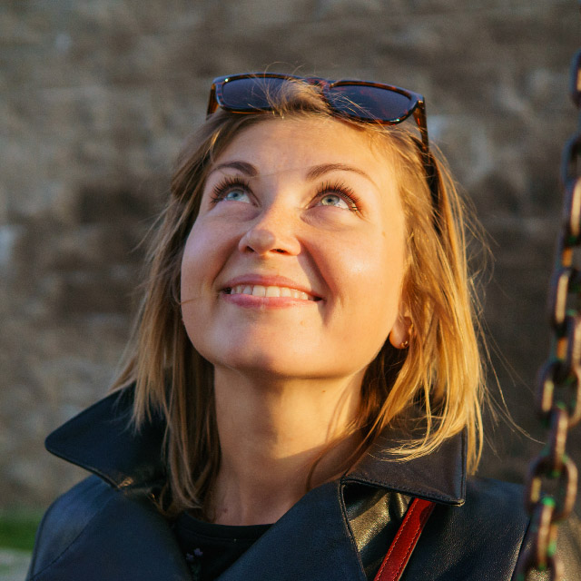

# **Junior Front End Developer**
------------------------
## Alena Kharytonchyk
### Contacts:
* phone: +37529255114
* e-mail: alena.kharytonchyk@outlook.com
* github: [Alena Kharytonchyk](https://github.com/AlenaKharytonchyk)
* Minsk,Belarus
### Summury:
I'm a front-end developer who is making first steps in this domain. I'm passionate about creating html-pages and working on layout and usability. I also have a teachable attitude and a desire to learn (as evidenced by my continued self-study).Looking for possibilities to gain new knowledge and professional experience
### Skills:

### Code examples:
### Experience:

### Education:
When | What | Where
-----|------|------
09.2005-05.2010 | Economics in Electronic Commerce | Belarusian State University of Informatics and Radioelectronics
09.2018-till now | JavaScript Development | The Rolling Scopes School
09.2018 & 03.2019 | Learn CSS | Codecademy
09.2018 & 03.2019 | Introduction to HTML | Codecademy
11.2017 | Introduction to Python for Data Science | Edx
10.2017 | Introduction to Python.Beginner | Edx
09.2017 | Gaming analytics: from fundamentals to advanced technique | DevtoDev
### English Level:
According to streamline tests, The Rolling Scopes offline presentation and EPAM interview I am B1 speaker.
